# MohamedYehya1854 — GitHub Profile

This repository contains my GitHub profile README and the custom animated SVG banner.

## Files

- `banner.svg` — custom profile banner inspired by the supplied terminal-style design.
- `README.md` — profile content.

## Usage

Put both files in the profile repository:

`MohamedYehya1854/MohamedYehya1854`

Then add:

```html
<p align="center">
  
</p>
```
