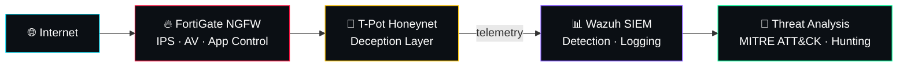

 

 

 

## About

**Network Security Engineer** focused on enterprise defense, security infrastructure, and blue team operations — bridging network engineering with SOC-level threat detection and investigation.

<table>
<tr>
<td width="50%" valign="top">

**🎓 Education**
B.Sc. Information Technology — Mansoura University

**🛡️ Focus**
Network Security · Blue Team · SOC

**🔥 Platforms**
Fortinet · Cisco · Palo Alto

**📡 Infrastructure**
Routing · Switching · VPN · NGFW

</td>
<td width="50%" valign="top">

**🔎 Detection**
Wazuh · SIEM · Threat Analysis

**🍯 Deception**
T-Pot · HoneyNets

**🧪 Lab Environments**
GNS3 · EVE-NG · PNETLab

**👨‍🏫 Mentoring**
60+ sessions · 100+ students

</td>
</tr>
</table>

 

## Tech Stack

  

  

 

## Defense Pipeline

`Prevent → Monitor → Detect → Investigate → Respond → Improve`

 

## Featured Project

<table>
<tr>
<td width="70%" valign="top">

### 🐝 HoneyShield
**SIEM-integrated honeynet for threat detection & analysis**

Graduation Project, Mansoura University — **Excellent (100%)**

A defensive cybersecurity platform built around deception-driven threat detection, combining honeynet telemetry, centralized SIEM monitoring, network security controls, and AI-assisted security analysis.

- Honeynet deployment & deception engineering
- Threat telemetry pipelines & centralized SIEM monitoring
- MITRE ATT&CK mapping & AI-assisted incident analysis
- Docker-based infrastructure

</td>
<td width="30%" valign="top" align="center">

 

**FortiGate → T-Pot → Wazuh → ATT&CK**

 

</td>
</tr>
</table>

 

## Selected Builds

<table>
<tr>
<td width="33%" valign="top">

**ML Network IDS**
Pattern Recognition · **100%**

ML-based intrusion detection on the NSL-KDD dataset — clustering + classification for attack detection.

`Python` `Scikit-learn`

<a href="https://github.com/MohamedYehya1854/Network-Intrusion-Detection-System-Using-ML-v1.0">View repo →</a>

</td>
<td width="33%" valign="top">

**Secure Enterprise Network**
DEPI — Fortinet · **95%**

Enterprise architecture with FortiGate, IPsec VPN, routing, NAT, and layered security policies.

`FortiGate` `IPsec`

<a href="https://github.com/MohamedYehya1854/Secure-Site-to-Site-Enterprise-Network-Design">View repo →</a>

</td>
<td width="33%" valign="top">

**Secure Bank Network**
DEPI — Cisco · **98%**

Segmented banking network using VLANs, ACLs, and inter-VLAN routing.

`Cisco` `VLAN` `ACL`

<a href="https://github.com/MohamedYehya1854/Bank-Network-Design-and-Implementation-Using-Cisco-Packet-Tracer">View repo →</a>

</td>
</tr>
</table>

 

## Certifications

| Fortinet NSE | Track |
|:---:|:---|
| **NSE 1–3** | Certified in Cybersecurity |
| **NSE 4** | FortiOS Administrator |

<b>Additional training</b>

 

- **NTI** — Multivendor Firewall Solutions Engineer
- **NTI** — Fortinet Cyber Security Engineer
- **NTI** — CCNA v7
- **DEPI** — Fortinet Cyber Security Engineer
- **DEPI** — Cisco Cyber Security Engineer
- **ITI** — Cloud & Infrastructure Security
- **ITI** — Network & Infrastructure Security

 

## Security Domains

<table>
<tr>
<td valign="top" width="25%">

**Network Security**
Firewall Admin
FortiGate / Palo Alto NGFW
IPsec / SSL VPN

</td>
<td valign="top" width="25%">

**Network Engineering**
Routing & Switching
VLAN / ACL / NAT
Infra Design & Troubleshooting

</td>
<td valign="top" width="25%">

**Blue Team / SOC**
SIEM & Threat Detection
Investigation & Response
Security Monitoring

</td>
<td valign="top" width="25%">

**Threat Intelligence**
MITRE ATT&CK
Honeypots / HoneyNets
Threat Hunting

</td>
</tr>
</table>

 

## Mentorship

> Technical knowledge compounds in value when it's shared.

| Year | Role |
|---|---|
| 2024 – present | Network Security Mentor & Content Creator · 60+ sessions delivered |
| 2025 – present | 100+ students mentored |
| 2025 | Network Security Head Mentor |
| 2025 – present | Cyber Security Vice Head Mentor · Blue Team Security Head Mentor |

`Cybersecurity Essentials` `CCNA` `FortiGate Admin` `FortiManager` `Blue Team Fundamentals`

 

## CTF & Research

| Competition | Result |
|:---|:---:|
| ZINAD IT × ITI Cyber Champions | 🏅 Rank 20 / 120 |
| Independent practice | 60+ rooms & labs solved |

 

## Current Focus

| Area | Progress |
|---|---|
| Threat Detection | `████████████████████` 100% |
| Threat Hunting | `███████████████████░` 95% |
| Detection Engineering | `██████████████████░░` 90% |
| Security Architecture | `█████████████████░░░` 85% |

 

## GitHub Analytics

  

  

 

## Connect

**Let's build something secure.**

  

*Secure the network. Detect the threat. Build the defense.*

⭐ If you find this work useful, consider starring a repository.

