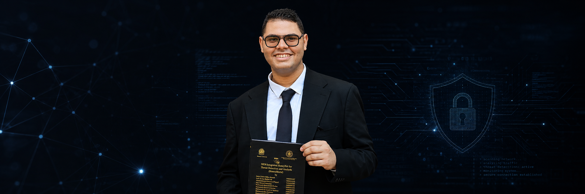

# 👋 Hey, I'm Mohamed Al-Tantawy Yehya

### 🛡️ Network Security Engineer · Blue Team & SOC · Fortinet · Cisco · CTF Player · Mentor

  <a href="https://www.linkedin.com/in/thenetknight">LinkedIn</a> •
  <a href="https://medium.com/@mohamedaltantawy1854">Medium</a> •
  <a href="https://www.youtube.com/@netknight1854">YouTube</a>

---

## 🧑‍💻 About Me

I'm a **Network Security Engineer** focused on enterprise network defense, firewall administration,
SOC operations, threat detection, and practical cybersecurity.

- 🎓 **B.Sc. in Information Technology** — FCIS, Mansoura University
- 📍 Mansoura, Dakahliya, Egypt 🇪🇬
- 🛡️ **Fortinet NSE 1–4 Certified**
- 🌐 Network security across **Cisco, Fortinet & Palo Alto**
- 🔎 Hands-on with **Wazuh SIEM, T-Pot Honeypot, EDR & Docker**
- 🧠 Interested in **Blue Team, SOC, Detection Engineering & Threat Hunting**
- 🚩 CTF Player — **20th / 120 teams** at Zinad IT × ITI Cyber Champions CTF
- 🎓 Network Security Instructor & Mentor with **60+ live sessions**

---

## 🛠️ Skills & Tools

### 🌐 Network & Security

  

**Cisco · Fortinet FortiGate · FortiManager · FortiAnalyzer · Palo Alto ·
IPsec VPN · SSL VPN · VLANs · ACLs · Routing · NAT · IDS/IPS · Network Security**

### 🛡️ SOC / Blue Team

  

**Wazuh SIEM · T-Pot Honeypot · EDR · MITRE ATT&CK · Threat Detection ·
Log Analysis · Incident Analysis · Honeynet · SOC Workflows**

### 💻 Programming & Tools

**Python · C# · Git · GitHub · GNS3 · EVE-NG · Cisco Packet Tracer · VMware ·
AWS · Docker**

---

## 🚀 Featured Projects

### 🐝 HoneyShield — AI-Powered SIEM-Integrated HoneyNet
**Graduation Project · Excellent (100%)**

A defensive cybersecurity platform combining:

`FortiGate` · `T-Pot` · `Wazuh SIEM` · `EDR` · `Docker` · `MITRE ATT&CK` · `AI-SOC Assistant`

The project integrates honeypot-based threat collection with SIEM monitoring and an
AI-assisted workflow for intrusion analysis and MITRE ATT&CK mapping.

---

### 🔐 Secure Site-to-Site Enterprise Network Design
**DEPI Fortinet Cyber Security Engineer · Excellent (95%)**

Enterprise branch-to-HQ architecture using FortiGate firewalls, IPsec VPN,
routing, NAT and security policies.

→ [View Project](https://github.com/MohamedYehya1854/Secure-Site-to-Site-Enterprise-Network-Design)

---

### 🏦 Bank Network Design & Implementation
**DEPI Cisco Cyber Security Engineer · Excellent (98%)**

Secure multi-floor enterprise network featuring VLANs, ACLs,
inter-VLAN routing and redundant infrastructure.

→ [View Project](https://github.com/MohamedYehya1854/Bank-Network-Design-and-Implementation-Using-Cisco-Packet-Tracer)

---

### 📡 Distributed File Transfer System
A distributed file-transfer application with a live monitoring panel,
built as a networking project using C#.

→ [View Project](https://github.com/MohamedYehya1854/Distributed-File-Transfer-System-with-Monitoring-Panel)

---

### 📂 FTP Client / Server Application
A C# FTP client/server implementation focused on practical networking
and file-transfer concepts.

→ [View Project](https://github.com/MohamedYehya1854/FTP-Client-Server-Application)

---

## 🏅 Certifications & Training

- **Fortinet NSE 1–4**
- **Cisco CyberOps Associate**
- **CCNA v7**
- **DEPI — Fortinet Cyber Security Engineer**
- **DEPI — Cisco Cyber Security Engineer**
- **NTI — Fortinet Cyber Security Engineer**
- **ITI — Cloud & Infrastructure Security**
- **ITI — Network & Infrastructure Security**
- **Palo Alto PCCET**
- **CCNP Security Core (SCOR)**

---

## 🎓 Teaching & Mentoring

I've delivered **60+ live online sessions** covering:

`Cyber Security Essentials` · `CCNA` · `FortiGate Administrator` · `FortiManager Administrator`

I also build hands-on labs using:

`Cisco Packet Tracer` · `GNS3` · `EVE-NG`

---

## 🚩 CTF & Cybersecurity

- 🏆 **20th out of 120 teams** — Zinad IT × ITI Cyber Champions CTF
- 🧩 **60+ rooms/labs** completed across TryHackMe, CyberTalent, Hack The Box & HackViser
- 🔍 Focus areas: Network Security, Blue Team, SOC, Web Security & CTF problem solving

---

## 📊 GitHub Stats

 

---

## 🎯 Current Goals

- 🌐 Grow into a strong **Network Security / Blue Team Engineer**
- 🛡️ Deepen expertise in **Fortinet, Cisco, SIEM & Detection Engineering**
- 🔎 Improve **Threat Hunting & Incident Response** skills
- 🚩 Continue competing in **CTFs**
- 📚 Keep mentoring and sharing practical cybersecurity knowledge

---

## 🤝 Let's Connect

  

### Thanks for visiting my profile! ⭐

